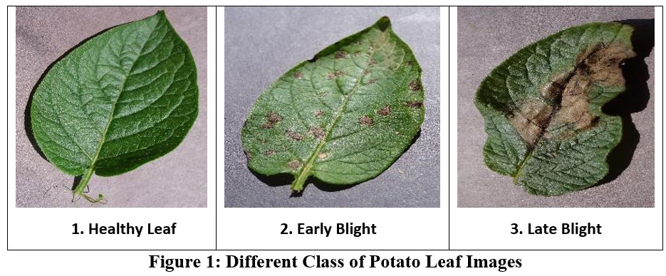

  

    <ul>
      
<h1 style="display: inline-block;">🥔 Potato Disease Classification</h1>

    </ul>
  

  
  
Deep Learning Project Using Tensorflow ,Mlflow, DVC, AWS & Flask 

    <!-- <a href="https://youtu.be/OWAefZ1vE8I" target="_blank">Demo</a>
    ·
    <a href="https://www.kaggle.com/datasets/arjuntejaswi/plant-village" target="_blank">Data</a>
    ·
    <a href="https://github.com/Hamagistral/Potato-Disease-Classification/issues" target="_blank">Request Feature</a>

 -->

## 🎯 Goal 

The goal of this project is to help farmers diagnose their crops. This project uses image classification using CNN architecture with Tensorflow to detect potato plant diseases, deployed to GCP and used in a web frontend app made with React.

## 💾 Dataset Used  

This data contains three datasets that contains photos of potato leaves. One dataset contains `Healthy` potato leaves, `Early Blight` and `Late Blight`.

More info about dataset can be found here :

- Github - https://github.com/alokpandey098/internship_projects/raw/main/Potatoes-leaf.zip

## 🛠️ Technologies Used

[LinkedIn](www.linkedin.com/in/alok-kumar-11075b252) •
[Gmail](kalok0575@gmail.com) •